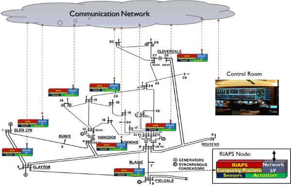
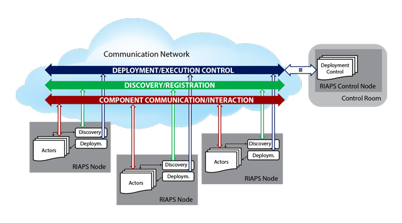
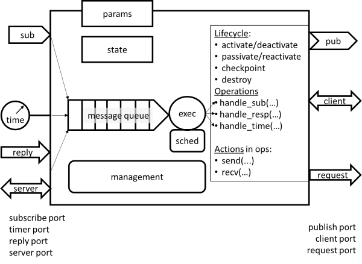
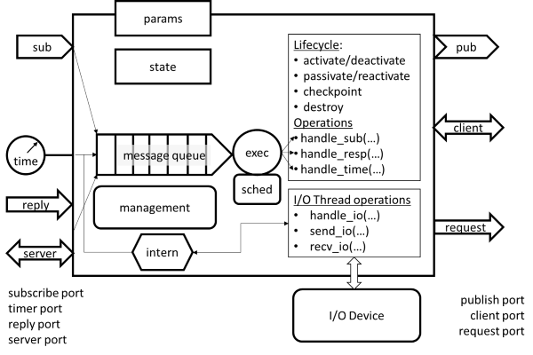
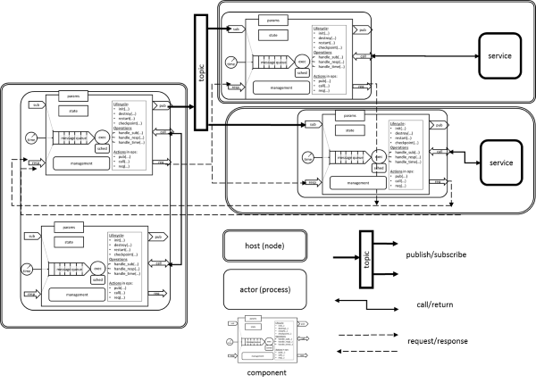

## Architecture for applications and operations

RIAPS is envisioned to serve as a *software platform* for implementing various functions in the Smart Grid using distributed computing. RIAPS computing nodes can be attached to various grid elements: substations, breakers, relays, transformers, etc., as shown on the diagram below.

### Application model

RIAPS provides a fully distributed, component-oriented application model.

A *component* is an object that interacts with other components *only* via messages -- RIAPS provides the primitives for sending and receiving messages. Components have *ports* that are used as arguments in the send and receive operations. The messaging framework delivers the messages from component to component. There is also as special type of port: the *timer* port that acts as a programmable one-shot or periodic source of messages (containing the current timestamp) for the component. A component runs in its own execution thread and the component execution engine releases the thread when a component is triggered, i.e. when a message arrives that the component expects. Note that the component can be time- or event-triggered.

Components are grouped into *actors* that are OS processes and run on hosts of a RIAPS network. An *application* (or *app*) consists of one or more actors that contain one or more components. A RIAPS *target network* consists of RIAPS hosts that communicate with each other using TCP/IP and run the RIAPS applications. We assume that there is routing among the nodes of the RIAPS network. We also assume that a dedicated node is available on the network to serve as the *control node*. The control node runs a development environment for building the RIAPS applications and an application, called the RIAPS *control app* that is used to download code to the RIAPS target nodes and to launch them.

The operational architecture of a RIAPS-based system is shown below.

#### Component interactions

RIAPS apps are formed from *interacting* components hosted in actors that run on various nodes of the network. The components participate in various *interaction patterns* that govern how the messages are handled.

The supported interaction patterns are as follows.

* *Publish/subscribe* pattern: publishers produce messages of specific topics that are delivered by the framework to subscribers to that topic. Publishers and subscribers are anonymous, and the interconnections are many-to-many.
* *Request/reply* pattern: a component sends a request message to and expect a reply message from another component. The interaction is asynchronous: the sender does not (explicitly) wait for a reply -- when the reply arrives, the sender component is triggered again. The new request cannot be sent until the reply to a previous request has been received. In other words, request sends and reply receives must progress in lockstep.
* *Client/server* pattern: similar to the request/reply pattern, except the interaction is synchronous -- the sender component must explicitly wait for a reply message. The same lockstep rule applies.
* *Query/answer* pattern: similar to the request/reply pattern, except the lockstep rule is not enforced: arbitrary number of requests can be sent (without an intervening reply received).

All component interactions in a RIAPS applications must be implemented using these patterns. Although the developer can use shared resources (e.g. shared files) for interactions, coordination via such means is outside of the scope of RIAPS.

#### Component execution

By default, all components are single threaded. In other words, the framework provides a thread to run the components code when the component is triggered. Note that components in the same actor run in separate threads, so an actor is multi-threaded. When a component is triggered, either because a message has arrived or because of a timer has fired, an associated handler method of the component object is called. Each port has an associated method whose name is derived from the name of the port. The called handler is expected to read the triggering message from the port (note that his message could be a time stamp if it was produced by a timer), execute some actions and possibly send messages out through ports, then return. A handler should never loop in an unbounded manner.

This scheme makes the component implementation easy but it does not work if the component message handler is expected to interact (and possibly block because) of an external device, like a serial port. For such cases, RIAPS provides a variant of a component called the *device component*.

A device component is just like a component except: (1) it can have more then one thread, and (2) it can have a special port called the 'inside' port for communicating between the threads. The device component has one executor thread that is scheduled just like any other component thread and executes the component's operations. However, a component operation can launch one or more threads that run concurrently with the main thread, and can interact with I/O devices. The main thread and the internal thread(s) can interact with each other via the inside ports -- these are ports for sending messages to (and receive messages from) the inner threads. For the outer executor thread, the inside ports act as input ports, hence the component can supply a method that gets triggered when the inside port has data available (that was sent by the inner thread). Similarly, the outer thread can send messages to the inner thread, etc. In other words, advanced developers can use this method to build specialized device components that have internal concurrency and can interact with physical devices directly.

### Services

RIAPS includes a number of services that support various application functions

#### Discovery service

The discovery service runs on the target nodes and acts as a registry so that message *producers* ports (publish, request, client, and query) and message *consumers* ports (subscriber, reply, server, and answer) can be linked together. This linking happens automatically, based on the model of the application architecture. The message producers register with the service, while the message consumers lookup in the service who can produce for them and then the linking happens. Note that this can happen in any order - early lookups that do not succeed immediately may be followed up by an asynchronous notification sent to the component. This process is done in the framework, hidden from the developer.

The discovery service has two implementation:
- distributed hash table, where a hash table contains the registrations, and the hash table is disseminated across the network. We use [OpenDHT](https://github.com/savoirfairelinux/opendht).
- centralized database, where a centralized database keeps track for all registrations. We use [Redis](https://redis.io/) for it, running on the RIAPS control node.
In a RIAPS installation only one of the methods can be used for all nodes (this can be selected in the installation on the target nodes).

When a RIAPS app actor is started, it connects to the discovery service. Whenever the app actor initializes a component of its application, it registers the message producers of the component with the service and looks who can provide messages for the component's message consumers. As application components start in an unpredictable order on the network, the lookup may not succeed immediately (if the message producer is a latecomer). For this reason, the discovery service can asynchronously notify the app component later, when the producer registers.

#### Deployment service

The deployment service also runs on the target nodes and it is responsible for starting all RIAPS processes: the discovery service and the application actors. For fault tolerance, the deployment service is usually automatically started (and re-started) by the system daemon on the target nodes.

When the deployment service starts it attempts to connect to the RIAPS control app. When it succeeds, it launches the discovery service process and waits for commands from the control app. The control app can then transfer the files of the RIAPS apps and then ask the deployment service to launch them. When the deployment service launches the app's actors, it (1) sets up a communication channel to them (so that they can report to the deployment service various issues, like exceptions in component code execution and they can receive notifications from the deployment service, like the availability of a new peer actor of the application on the network), and (2) monitors the actor and detects if it has terminated unexpectedly. In the latter case, it automatically restarts the actor.

The deployment service also implements a number of related functions, listed below.
* __Resource management__: Application actors can be configured to limit their (1) CPU utilization, (2) memory utilization, (3) disk space utilization, and (4) network bandwidth utilization. For such actors, the deployment service configures the operating system accordingly and monitors what the actor is doing. When the actor attempts to exceed the limits, it will receive a special message from the deployment service and the application component can react to this message.
* __Fault management__: Faults can happen at any level: in a component, actor, system service, or network. The deployment service detects such faults. In some cases it reacts to them autonomously (e.g. it restarts the application actor when crashed), in other cases it just informs the application components via a special message and they can react to this message.

The deployment service is also responsible for the secure setup, starting and stopping of application actors, under the command of the control app. For secure setup, each application actor runs under its own (non-privileged) user-id and in its own folder (which is isolated from all other folders on the disk).

#### Time synchronization service

The time synchronization service keeps the system clocks of the RIAPS target network nodes synchronized. It relies on the IEEE-1588 (PTP) protocol for clock distribution -- this has to be supported on the network interface the RIAPS nodes use. The source for the clock (i.e. the absolute time) can be a GPS receiver attached to a target node or an NTP server. Whatever source is used, PTP will ensure that the other clocks in the system follow the main clock source. If that fails for some reason, it can fail over to another clock source automatically.

#### Control app

Although it is not a service and it runs the control node (or development host), the control app provides important services: (1) preparing a download package of the RIAPS application, (2) transferring the download package to the target nodes, (3) commanding the deployment service running on the target nodes to launch/stop/remove the applications. It has a simple GUI, but it can also work from a script. It is the tool one can use to download and manage the execution of applications on the RIAPS network.
