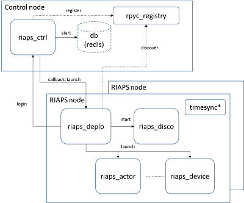
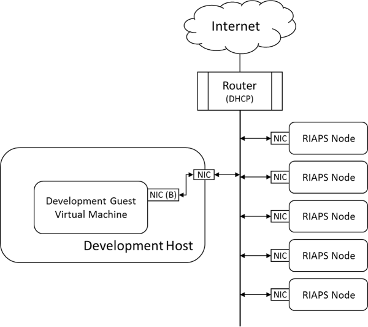

## Implementation details

RIAPS relies on an underlying Linux operating system - currently we are using Ubuntu 18.04. Any hardware platform that runs this OS will likely run (most of) RIAPS. One of the RIAPS services: the time-synchronization service requires that the network interface of the hardware platform supports the IEEE-1558 (Precision Time Protocol). This is necessary for high-precision (read: better than NTP) time synchronization only. 

The two main implementation languages are Python (3.6) and C++ (as supported by gcc-7).

Application components can be implemented in Python and in C++. In both cases the developer has to follow a structure for the components.

The table below lists the main ingredients of RIAPS. Note that these are only the main processes; there are several run-time libraries, configuration files, etc. 

RIAPS element | Definition                                     | Runs on  
--------------| ---------------------------------------------  |-------------
riaps_actor   | App run-time system that dynamically loads   and runs components. Each app actor runs as   a separate instance of riaps_actor. | Target nodes
riaps_device  | A special verions of riaps actor that holds   only device components | Target nodes
riaps_deplo   | RIAPS deployment service (singleton) | Target nodes
riaps_disco   | RIAPS discovery service (singleton)  | Target nodes
timesyncctl   | Management tool for the time   synchronization service. | Target nodes
timesyncd     | Supervisor daemon for the   synchronization service. | Target nodes
riaps_ctrl    | RIAPS control service (singleton)    | Control node
rpyc_registry | Registry service   Courtesy of https://github.com/tomerfiliba/rpyc | Control node

### riaps_actor

This is the executable that dynamically loads and executes RIAPS components. It is implemented in Python and it uses the dynamic loader to load components implemented either in Python or C++. One riaps_actor process is one application actor, and a multi-actor application runs multiple riaps_actor processes. riaps_actor is not functional alone, it communicates with its parent: the deployment manager (riaps_deplo) and the discovery service (riaps_deplo). The components it loads communicate with their peers within the application. 

Each riaps_actor runs under a dynamically generated user-id/group-id, with non-root privileges. It is launched by riaps_deplo.

### riaps_device

This the executable that dynamically loads and executes RIAPS device components. It is very similar to riaps_actor, except: (1) every riaps_device holds only one (device) component, (2) device components are singletons (i.e. a device runs in a single copy on a host), and (3) the component can communicate only with components within the same host (i.e. a device component running in a riaps_device cannot be accessed from the network).

Each riaps_device runs under root privileges. It is launched by riaps_deplo.

### riaps_deplo

This executable implements the deployment manager that provides the deployment service, resource management, and fault management. It typically runs as root, although it can be started as non-root, in which case some functionalities will be lost (like resource management). Its main task is to receive control commands from the control node (riaps_ctrl) and control the execution of the apps: launch, stop, and remove. It launches the riaps_actors of the app, and the riaps_devices on behalf of the apps. It maintains communication with the actors: it sends messages to them, as well as it receives fault notifications.

When started, it locates the riaps_ctrl process by doing a lookup with the help of the rpyc_registry (for the name RIAPSCONTROL). For this reason, the RIAPS target nodes and the control node must be on the same IP subnet.

This process can be started manually, although typically it is started by the systemd of Linux. It is implemented in Python. 

### riaps_disco

This executable implements the discovery service. When an actor is started it connects to this service and registers its message producers, and looks up its message consumers via this service. The service is started automatically by riaps_deplo.

### timesyncd and timesyncctl

The `timesyncd` service tunes the configuration of the underlying components of the time synchronization service. Primarily, it monitors if a GPS reference clock and/or a control host is available as additional timing references. The `timesyncctl` tool is a command tool to configure the time-syhnchronization service based on pre-defined roles (See the documentation on the `riaps-timesync` repository for details). The service is somewhat independent from the other elements of RIAPS as it's function is to keep the clocks of the hosts synchronized. The clock can be read by application components using standard calls available in Linux. 

### riaps_ctrl

This executable runs on the control node and is used for download apps to the target nodes and launching them via the riaps_deplo instance running on those nodes. 

The figure below shows how the various elements are deployed on a system. 

## Installation

A RIAPS installation includes one development / control host, and a network of target hosts. For the former a pre-configured virtual machine is provided: an x86_64 (or amd64) machine (although a physical machine cna be used as well, after some serious configuration). For the latter we provide a bootable SD card image for a Beaglebone Black (BBB) board.  

The development host and the target nodes must be on the same subnet. 

One scheme for this is shown below. Here, all nodes are connected to a router that runs a DHCP service. In this case all machines can access the Internet if needed. 

Another scheme for this is when the development machine has two NICs, and one is used for Internet connectivity and the second one is used for connecting to the target nodes. 

As discussed above, development runs riaps_ctrl (and rpyc_registry), while the target nodes run riaps_deplo (that will launch riaps_disco, riaps_actor, riaps_device). 

### Some configuration

If a host has multiple physical NICs, riaps_ctrl and riaps_deplo must know which NIC to use. This is controlled by a configuration file: /usr/local/riaps/etc/riaps.conf via an entry called 'nic_name'. This has to be set to the name of the NIC, e.g. eth0 on the BBBs, enp0s3 for VMs. If not set, RIAPS will attempt to use the first NIC which it finds on the machine. 

riaps_deplo typically runs on the target nodes with root privileges but under the username riaps. The riaps_actors it launches run under a dynamically generated user name. The target nodes must have a riaps user account with the security keys set up. The BBB image has these pre-configured. 

riaps_deplo relies on two environment variables that must be set correctly.
- RIAPSHOME should point to the location of the RIAPS data files. On the VM and BBB images it is set to /usr/local/riaps. 
- RIAPSAPPS should point to a folder where the apps are downloaded to and are run from. On the VM and the BBB images it is set to ~riaps/riaps-apps. 

