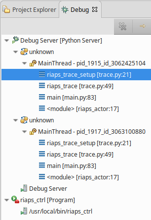

## Using the Python Debugger for RIAPS Components

This section describes how to debug RIAPS components without modifying them using logging statements.  This method utilizes the [PyDev](https://www.pydev.org/manual_adv_remote_debugger.html) toolkit.

We assume that Eclipse is used for developing RIAPS application components. The Python development environment has a debugger (PyDev) that can be used for debugging the components running within actors on the RIAPS target nodes while the graphical front-end of the debugger is running on the development machine. The debugger uses the Python source code of the components located on development host.

>Note: The same debugger can also be used for debugging the RIAPS framework itself.

### Page Contents
* [Code Preparation for Debugging](#debug-prep)
* [RIAPS Debugging Configuration](#debug-conf)
* [Debugging Process](#debug-process)

### <a name="debug-prep">Code Preparation for Debugging</a>

PyDev must be included in the component code to provide hooks for the remote debugger.  Include ```import pydevd``` in the components needed to debug issues.  Then a starting tracepoint must be included to indicate the IP address of the development host node and the port used for debugging.  Port 5678 is the default port. This trace setup is typically located in the component initialization code to allow full debugging of the component code, but can be located anywhere in the code.

```pydevd.settrace(host='192.168.1.103',port=5678)```

### <a name="debug-conf">RIAPS Debugging Configuration</a>

When an actor (or a device component that runs in its own device actor) on the target node is started it must connect to the debugger front end that runs on the development host. This is controlled by a configuration attribute in the */usr/local/riaps/etc/riaps.conf* file on the target node. See the [RIAPS Configuration Files](https://github.com/RIAPS/riaps-pycom/blob/master/src/riaps/etc/README.md) information for how to configure the target nodes for debugging.  Setup 'actor_debug_server' to debug application components and 'device_debug_server' to debug device components.

### <a name="debug-process">Debugging Process</a>

Having configured the target node, a debugging session can be started as follows:

1. Launch Eclipse, open the project that contains the code for the app components. Open a component and set a breakpoint somewhere (e.g. in the constructor, or at any operation).

2. Launch the ***riaps_ctrl*** application on the development host. Launch the deployment manager on the target host (unless it is already running).

3. In Eclipse, select the **Debug** perspective (either an available tab or use **Window** menu and **Show View** to find it).

4. Launch the debug server using **Start Debug Server** under the **Pydev** menu.

4. Use ***riaps_ctrl*** to launch the application from the development host on the target hosts.

5. When the ***riaps_actor*** (or ***riaps_device***) is started, it will link up to the debugger running on the development host. This event will activate the debugger, that will stop the code running on the target machine at a specific place within the RIAPS code. The **Resume(F8)** button should be used at this point to let the program proceed. <br/>

> Note: This will happen for each actor/device started on the target node. Watch out for the processes running under the Debug Server with the name **unknown** -- these are the remote actors/devices running on the target. Each one of these should be resumed after the initial connection. Make sure the **riaps_trace_setup** thread is selected (see image below) before resuming. If multiple target nodes have debugging enabled, then a process will show up under the Debug Server for each actor/device on each target node.<br/><br/> 

6. After the initial connection to the debugger has been made, the debugger will stop the target code at a breakpoint, and the usual debugging activities can commence.

7. The app should be managed / terminated using the ***riaps_ctrl***, as usual. Note that whenever the app is restarted, the connection to the front-end debugger will take place.

8. Once debugging is finished, the **riaps.conf** file should be restored to its original state (i.e. no values for the 'actor_debug_server' / 'device_debug_server' parameters). This will turn off debugging on the target node.
