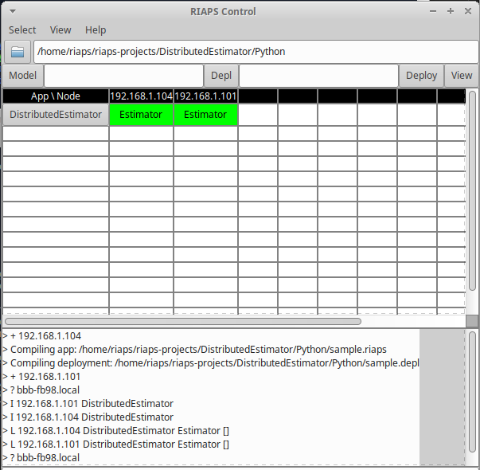

# RIAPS Application Management Tutorial

Each RIAPS system includes a dedicated control node that will launch and control applications using the RIAPS control app (**riaps_ctrl**) to interact with available RIAPS hosts.  Each available RIAPS host runs a deployment control application (**riaps_deplo**), which is typically running as a background process on the remote hardware.  This tutorial will explain how to deploy a RIAPS application using the control app and how to verify the system is working as desired.
>MM TODO:  update summary after developing more of below

## RIAPS Control App (riaps_ctrl)

### <a name="app-start">Application Startup</a>

To find the available RIAPS hosts, the control node must be configured to see the network interface where the host nodes are connected.  See **[Configuring Environment for Local Network Setup](https://github.com/RIAPS/riaps-integration/tree/master/riaps-x86runtime#configuring-environment-for-local-network-setup)** for instructions on setting this configuration option to the desired network interface.  If the network configuration option is updated, then the ***riaps-rpyc-registry*** systemd service used in registering RIAPS nodes needs to be restarted (command shown below) in order to monitor the correct network interface.

```
sudo systemctl restart riaps-rpyc-registry.service
```

Starting the RIAPS control app (riaps_ctrl) will launch a controller graphical application (shown below).  This interface will be used to select the application location and the model files used to define the application and its deployment.   A visual of the various elements used in the riaps_ctrl tool is found in the [controller implementation discussion](https://github.com/RIAPS/riaps.github.io/blob/master/impl.md#riaps_ctrl).


The control app also starts ***redis-server*** in the background.  If the control application started up successfully, the logging information (in the window where the application is started) will state that it is **"Ready to accept connections"**.  If the control app was not shutdown properly and left the redis-server process running, restarting the control app will indicate that the socket at port 6379 has the **"Address already in use"**.  The control app should be shutdown and the running redis-server process should then be removed (using ```sudo pkill -9 redis-server```).  The riaps_ctrl tool can then be restarted to find the correct port connection.

* Successful launch of riaps_ctrl

  ```
  riaps@riaps-devbox:~/$ riaps_ctrl
  29220:C 18 Feb 14:13:44.670 # oO0OoO0OoO0Oo Redis is starting oO0OoO0OoO0Oo
  29220:C 18 Feb 14:13:44.670 # Redis version=4.0.11, bits=64, commit=fd6b747b, modified=0, pid=29220, just started
  29220:C 18 Feb 14:13:44.670 # Configuration loaded
  29220:M 18 Feb 14:13:44.670 * Increased maximum number of open files to 10032 (it was originally set to 1024).
                  _._                                                  
             _.-``__ ''-._                                             
        _.-``    `.  `_.  ''-._           Redis 4.0.11 (fd6b747b/0) 64 bit
    .-`` .-```.  ```\/    _.,_ ''-._                                   
   (    '      ,       .-`  | `,    )     Running in standalone mode
   |`-._`-...-` __...-.``-._|'` _.-'|     Port: 6379
   |    `-._   `._    /     _.-'    |     PID: 29220
    `-._    `-._  `-./  _.-'    _.-'                                   
   |`-._`-._    `-.__.-'    _.-'_.-'|                                  
   |    `-._`-._        _.-'_.-'    |           http://redis.io        
    `-._    `-._`-.__.-'_.-'    _.-'                                   
   |`-._`-._    `-.__.-'    _.-'_.-'|                                  
   |    `-._`-._        _.-'_.-'    |                                  
    `-._    `-._`-.__.-'_.-'    _.-'                                   
        `-._    `-.__.-'    _.-'                                       
            `-._        _.-'                                           
                `-.__.-'                                               

  29220:M 18 Feb 14:13:44.671 # WARNING: The TCP backlog setting of 511 cannot be enforced because /proc/sys/net/core/somaxconn is set to the lower value of 128.
  29220:M 18 Feb 14:13:44.671 # Server initialized
  29220:M 18 Feb 14:13:44.671 # WARNING overcommit_memory is set to 0! Background save may fail under low memory condition. To fix this issue add 'vm.overcommit_memory = 1' to /etc/sysctl.conf and then reboot or run the command 'sysctl vm.overcommit_memory=1' for this to take effect.
  29220:M 18 Feb 14:13:44.671 # WARNING you have Transparent Huge Pages (THP) support enabled in your kernel. This will create latency and memory usage issues with Redis. To fix this issue run the command 'echo never > /sys/kernel/mm/transparent_hugepage/enabled' as root, and add it to your /etc/rc.local in order to retain the setting after a reboot. Redis must be restarted after THP is disabled.
  29220:M 18 Feb 14:13:44.671 * Ready to accept connections
  ```

* Unsuccessful launch of riaps_ctrl

  ```
  riaps@riaps-devbox:~$ riaps_ctrl
  29542:C 18 Feb 14:30:49.074 # oO0OoO0OoO0Oo Redis is starting oO0OoO0OoO0Oo
  29542:C 18 Feb 14:30:49.074 # Redis version=4.0.11, bits=64, commit=fd6b747b, modified=0, pid=29542, just started
  29542:C 18 Feb 14:30:49.074 # Configuration loaded
  29542:M 18 Feb 14:30:49.075 * Increased maximum number of open files to 10032 (it was originally set to 1024).
  29542:M 18 Feb 14:30:49.075 # Creating Server TCP listening socket *:6379: bind: Address already in use
  ```

### <a name="node-reg">RIAPS Node Registration</a>

Once the control application is running, available RIAPS nodes will begin to register and be revealed as a column in the App/Node section.  The bottom section of the controller will also log the registration of a node by indicate plus sign and the IP address of the node added: **+192.168.1.103**. When nodes are removed, the node's column will be removed and the logging section will show a minus sign and the IP address of the node being removed: **-192.168.1.103**.

If security is enabled on the controller node, then only the RIAPS nodes with security enabled and with the correct key configuration will be found by the controller.  If security is turned off, then only the RIAPS nodes with security disabled will be located by the RIAPS Control, secure RIAPS nodes will not be available.  Once all the desired nodes are available, the application can then be selected and deployed to these nodes (per the deployment model).

### <a name="app-select">Application Selection</a>

The file selection (the file folder under the menus) is the location of the component code that will be downloaded to the available RIAPS nodes when the application is launched.  If you are working with Python components only, selecting the appropriate folder is all that is necessary.  If you are working with C++ components, then make sure to compile the component code to create library file (.so) to the appropriate hardware architecture (amd64 or armhf) and have them available in the selected folder.  During development, if changes are made to the component code be sure to recompile the library file.

When selecting the **Model** and **Depl** (or deployment) files, the selected files are compiled as they are loaded.  If the file is valid and compiles correctly, as message will appear in the lower portion of the application to indicate that the file has been compiled and no errors are presented.  If there is an error in these files as they get loaded, an error will be presented in addition to the compiling message.  This error message should provide information on the first error found while compiling.  Another method to check the validity of these model files is to scripts to individually compile these files.  ```riaps_lang <model filename>``` can be used to check the model file (.riaps) and ```riaps_depll <depl filename>``` can be used to check the deployment file.  Using these check tools will also provide more information on the location of the first error found.

Once valid model and deployment files are loaded, the user can view how this application will be deployed given the specified RIAPS nodes by using the **View** button (right side of the controller application - see image below).  Looking at this view of the deployable application will help the developer and deployment manager to understand how the components of the application will be distributed across the available RIAPS nodes.  This can be a useful system level debugging tool.


### <a name="app-deploy">Application Deployment</a>

After the application is ready, the application is deployed to the available nodes by selecting the **Deploy** button.  To launch an application on the nodes, click on the **AppName** button that appeared when the application was deployed (in the image below, the AppName=DistributedEstimator).  The **Launch** button is then available.  This is also where the application management options are found: **Stop** and **Remove**.  Stop just halts the running application, leaving the application code on the RIAPS nodes.  Remove is used to delete the application code and resulting logging files from the RIAPS node.


When an application successfully deploys, the list of actors loaded on each RIAPS node will be indicated below the appropriate node's column and will turn green when running.  When the application is stopped (but not removed), these actor indicates will be in a gray box.  Also, the logging information in the controller shows that the application has been installed by indicating **I** and then the node and application installed.  Once successfully installed remotely, the application in launched, which is indicated by **L** and then the node, application and actors started (show in image below).


When stopping an application, the logging will be indicated with a **H** and then the node, application and actors removed.  When all application is removed from the RIAPS nodes, the logging will be indicated with a **R** and the application name.

>NOTE: If file logging is utilized (see [Component Logging Tutorial](tutorials/logging.md)), then the user MUST retrieve the log files before removing the application from the nodes or the data will be lost.

The easiest way to grab log files from RIAPS node is use [***riaps_fab***](https://github.com/RIAPS/riaps-pycom/tree/master/src/riaps/fabfile) command ***sys.get***.  Since using riaps_fab can pull from multiple RIAPS nodes and all the log files for the application on each node are named the same, this command should be performed individually for each RIAPS node of interest so that you have control of the file location (separating based on RIAPS node pulled).  To transfer application log files from specific hosts, use the command below.  This command will get the files from the application deployment folder (riaps_apps/appname) and assumes that the log files were saved to a subdirectory of the application (appname) called "log".  The log file location on the remote nodes is configurable in the riaps-log.conf file included with the application (see [Customizable Component-Level Logging](tutorials/logging.md#logging-custom)).  The remote node application folder is protected, so sudo=true.

```riaps_fab sys.get:riaps_apps/<appname>/log/*,.,true -H <hostname>```

## <a name="deploy-tips">RIAPS Node Debugging Tips</a>

When an application is deployed in the field, the available RIAPS nodes are typically remote computing nodes (such as the Beaglebone Black).  But developers may choose to debug component code locally on the controller node (or VM), which is handled slightly differently (indicated below).  The remote computing nodes are configured to automatically run the ***riaps-deplo.service*** when the system is booted up.  This allows easy remote startup of applications.

To verify if the desired remote nodes are available for communication, utilize the ```riaps_fab sys.check``` command, see [RIAPS Fabric File Information](https://github.com/RIAPS/riaps-pycom/tree/master/src/riaps/fabfile) for setting up the riaps-host.conf file.  Successful communication will be when all remote nodes indicate their hostnames and kernel information.  It is possible to reboot or shutdown a specific host using the following commands respectively:  ```sys.reboot -H <hostname>``` and ```sys.shutdown -H <hostname>```.

To see the application logging activity on the remote nodes, ssh into the desired node and look at the system logs (see [Default Logging tutorial](tutorial/logging.md#logging-default)).

During application development, there may be several ways a system may appear to be non-responsive.  A component may not be handling request/reply communication appropriately and the application hangs up (i.e. request made and then another request made before a reply is received).  Or when developing a device component that utilizes system ports (such as UART) is not functioning as desired and the port is now stuck open.  These are just a couple of instances to consider.  To reset the system, there are two way to reset the RIAPS framework on the RIAPS nodes:  using the RIAPS Controller application or riaps_fab command.

>MM TODO: - Using kill in control app (image available - riaps-ctrl-menu1.png) or fab scripts: riaps.kill, deplo.stop/deplo.start

When debugging applications on the controller node, the RIAPS deployment application needs to be started manually using ```sudo -E riaps_deplo```.  To communicate with this deployment instance using riaps_fab, utilize the local reference for the node:  i.e. ```riaps_fab sys.check -H localhost```.  Never put "localhost" in the "riaps-host.conf" file.

>MM TODO:  Discuss Configuration file updates to RIAPS nodes and riaps_fab command that is useful

## Application Deployment Debugging Tips

### <a name="missing-node">Missing RIAPS Node</a>

If an application model includes a RIAPS node specification for a node that is not currently available, the application can be deployed on the available nodes.  The missing node will be indicated in the controller log section by **?** and the node name specified by the deployment model (.depl).  Either determine why this node is offline or pick an available node.



### <a name="key-issue">SSH Key Issue</a>

When deploying an application, the available RIAPS node's ssh keys (public and private) should match the ssh keys of the controller node.  These keys are located in '/usr/local/riaps/keys' folder (id_rsa.pub and id_rsa.key).  If they do not match (even when security is turned off on both the controller and the RIAPS node), then an **App download fault** will occur with and indication that there was an **Error while verifying app 'appName'** (see image below).  It will also indicate the RIAPS node where the deploy issue occurred.


